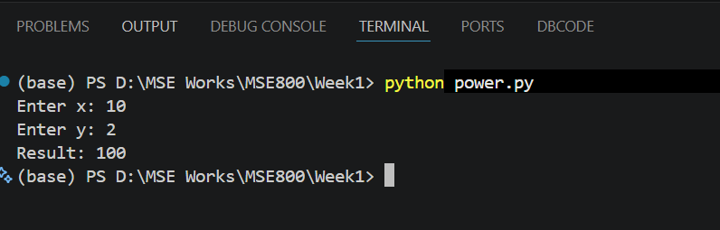

# Week 1 - Activity 3

## Description

This code calculates the power of a number (x^y) using python.

## How to Run

Run power.py and input values for x and y.

1. Activate conda environment:

```
conda activate MSE800
```

2. Run the program:

```
python power.py
```

## Example

**Input:**

```
Enter x: 10  
Enter y: 2
```

**Output:**

```
Result: 100
```

## Screenshot

